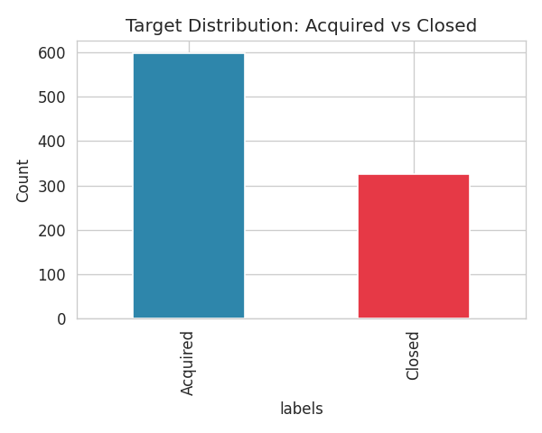
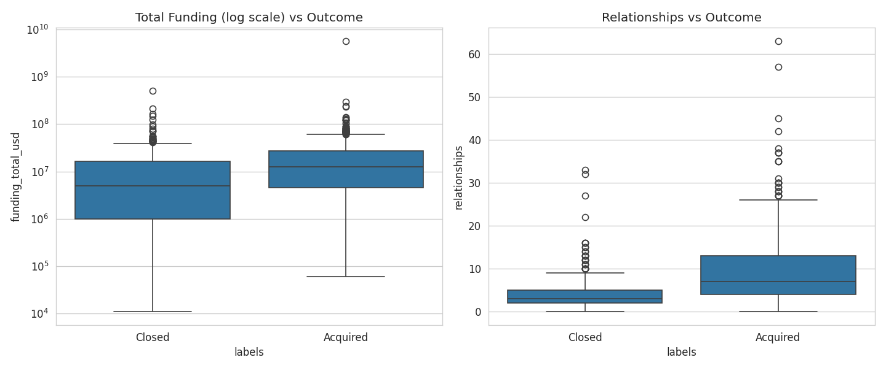
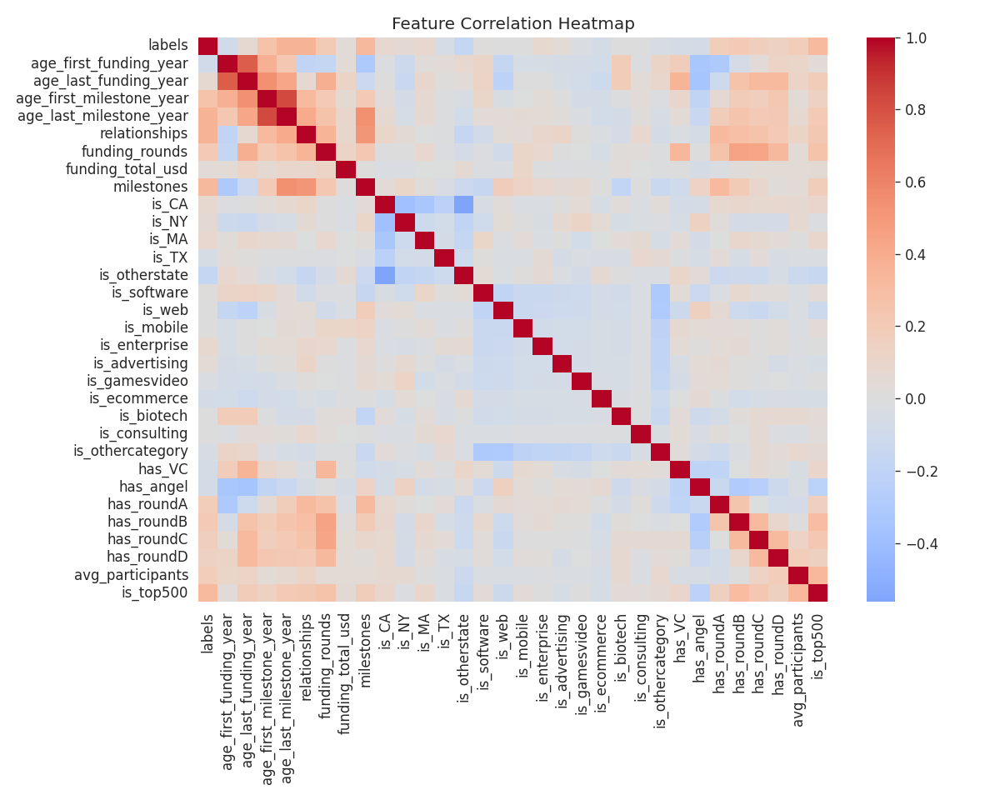
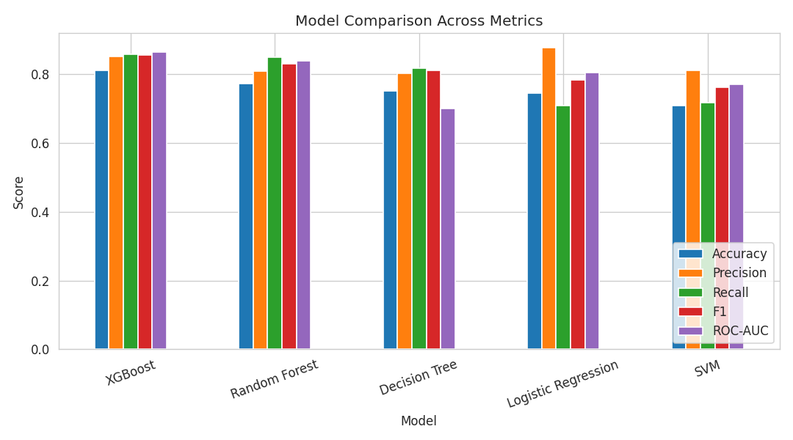
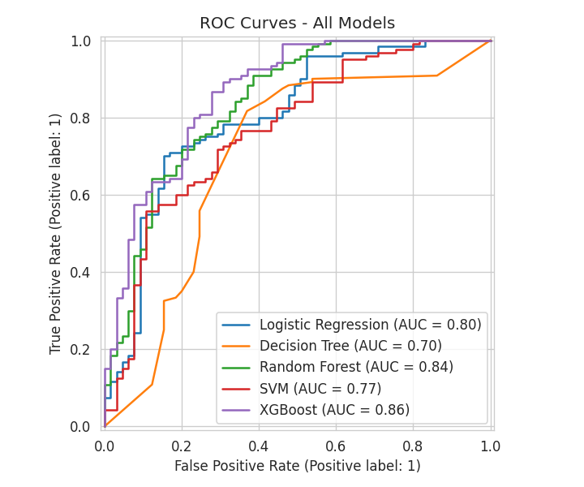
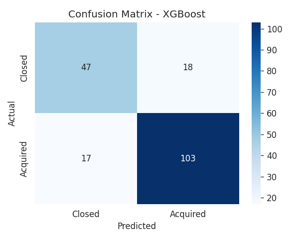
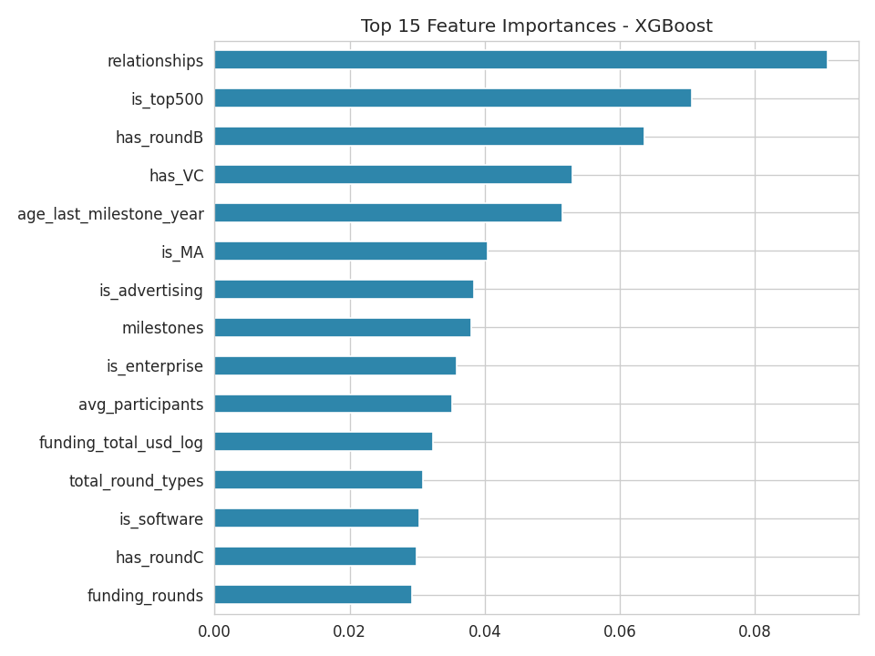

# 🚀 Startup Success Prediction

Predicting whether an early-stage startup will be **acquired** or will **close**, using historical funding, milestone, and network data. Built as an end-to-end, portfolio-ready machine learning project — from raw data to a deployed web app.

**[Live Demo](#) · [Notebook](notebooks/startup_success_prediction.ipynb) · [Web App Code](app/app.py)**

---

## 📌 Problem Statement

Venture investors and founders alike want an early read on which startups are likely to succeed. Using a dataset of 923 historical startups (Crunchbase-style data covering funding rounds, founding dates, milestones, and investor relationships), this project builds a binary classifier to predict startup outcome: **Acquired (1)** vs **Closed (0)**.

## 📊 Dataset

- **923 startups**, 49 raw features
- Target: `status` → recoded as binary `labels` (0 = closed, 1 = acquired)
- Class balance: 597 acquired (64.7%) vs 326 closed (35.3%)
- Features span: funding history (rounds, total raised, round types), company milestones, founder/investor relationships, geography (state), and industry category



## 🔧 Pipeline Overview

| Stage | What was done |
|---|---|
| **Data Cleaning** | Dropped identifier/leakage columns (`id`, `object_id`, raw `status`, `closed_at`); parsed dates; imputed milestone-age missingness with 0 (absence of a milestone is itself informative) |
| **EDA** | Analyzed target balance, funding vs. outcome, category-wise acquisition rates, and a full correlation heatmap |
| **Feature Engineering** | Engineered `funding_duration_days`, `funding_per_relationship`, `milestone_velocity`, `total_round_types`, log-transformed funding totals, and frequency-encoded `category_code` / `state_code` |
| **Train/Test Split** | 80/20 stratified split to preserve class ratio |
| **Class Imbalance** | Applied **SMOTE** on the training set only (avoids test-set leakage) |
| **Dimensionality Check** | Ran PCA for exploratory variance analysis; kept the full feature set for modeling since tree-based models handle correlated features natively and full features preserve interpretability |
| **Modeling** | Trained and 5-fold cross-validated 5 classifiers: Logistic Regression, Decision Tree, Random Forest, SVM, XGBoost |
| **Evaluation** | Compared Accuracy, Precision, Recall, F1, and ROC-AUC on the held-out test set |
| **Deployment** | Best model serialized with `joblib` and served through an interactive Streamlit app |

## 📈 Exploratory Findings

- Startups with more **relationships** (investor/partner connections) and more **milestones achieved** show a markedly higher acquisition rate.
- `is_top500` ranking correlates strongly with a positive outcome.
- Category and funding-round breadth (`has_roundA` through `has_roundD`) show meaningful — but secondary — predictive signal.




## 🤖 Model Results

5-fold cross-validated F1 scores, then evaluated on a held-out 20% test set:

| Model | Accuracy | Precision | Recall | F1 | ROC-AUC |
|---|---|---|---|---|---|
| **XGBoost** ⭐ | 0.811 | 0.851 | 0.858 | **0.855** | 0.865 |
| Random Forest | 0.773 | 0.810 | 0.850 | 0.829 | 0.838 |
| Decision Tree | 0.751 | 0.803 | 0.817 | 0.810 | 0.701 |
| Logistic Regression | 0.746 | 0.876 | 0.708 | 0.783 | 0.804 |
| SVM | 0.708 | 0.811 | 0.717 | 0.761 | 0.771 |

**Best model: XGBoost**, selected on F1 score (balances precision and recall on the moderately imbalanced target).





### Top Predictive Features



The strongest predictors of acquisition are the number of investor/partner **relationships**, **milestones achieved**, **funding round breadth**, and **Top 500 ranking** — consistent with the EDA correlation findings.

## 🖥️ Web App

An interactive Streamlit app lets you enter a startup's profile (funding, milestones, category, state) and get a real-time acquisition probability.

```bash
cd app
streamlit run app.py
```

## 🗂️ Project Structure

```
Startup-Success-Prediction/
├── app/
│   └── app.py                  # Streamlit prediction app
├── assets/                     # EDA & evaluation plots (used in this README)
├── data/
│   ├── startup_data.csv                # raw dataset
│   └── startup_data_processed.csv      # cleaned/engineered dataset
├── models/
│   ├── best_model.pkl           # trained XGBoost model
│   ├── scaler.pkl                # fitted StandardScaler
│   ├── feature_columns.pkl       # ordered feature list expected by the model
│   ├── category_freq_map.pkl     # category frequency-encoding lookup
│   └── state_freq_map.pkl        # state frequency-encoding lookup
├── notebooks/
│   └── startup_success_prediction.ipynb   # full analysis notebook
├── requirements.txt
└── README.md
```

## ⚙️ Setup & Reproduction

```bash
git clone https://github.com/jermiahvincy03/Startup-Success-Prediction.git
cd Startup-Success-Prediction
pip install -r requirements.txt

# Reproduce the full analysis
jupyter notebook notebooks/startup_success_prediction.ipynb

# Run the app
cd app && streamlit run app.py
```

## 🛠️ Tech Stack

`Python` · `pandas` · `NumPy` · `scikit-learn` · `XGBoost` · `imbalanced-learn (SMOTE)` · `matplotlib` / `seaborn` · `Streamlit` · `joblib`

## 🔮 Future Improvements

- Hyperparameter tuning via `GridSearchCV` / `Optuna` for further F1 gains
- SHAP-based explainability for individual predictions in the app
- Expand dataset with more recent startups to reduce staleness of the (2020-era) source data

## 👤 Author

**Jermiah V** — M.Sc. Data Science, St. Joseph's College (Autonomous), Trichy
[GitHub](https://github.com/jermiahvincy03) · [LinkedIn](https://linkedin.com/in/jermiah-v-8037632a0)
